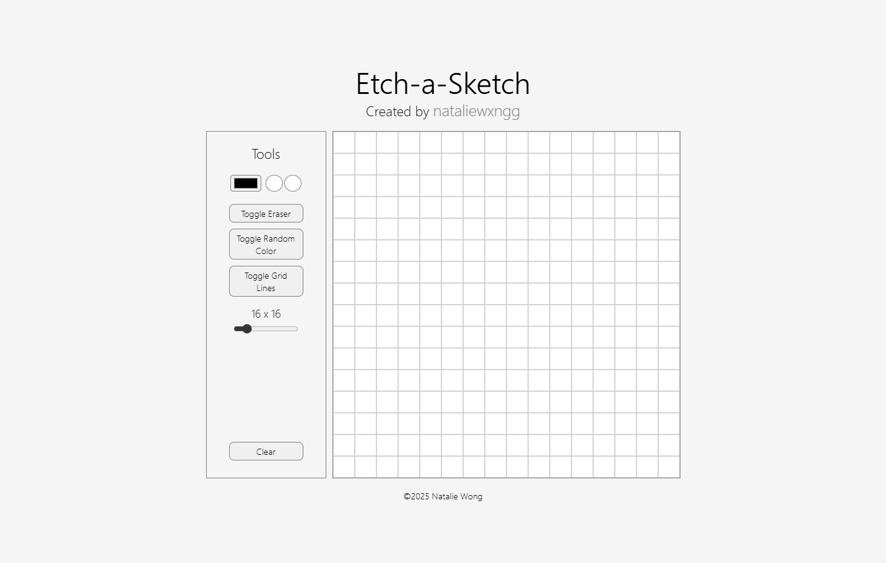
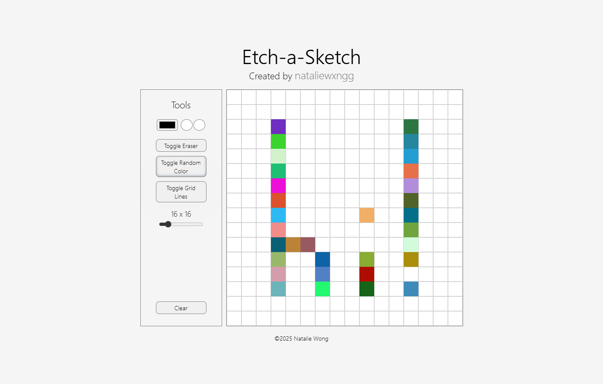

<h1>Etch-a-Sketch</h1>

Natalie Wong | January 7, 2025

Etch-a-Sketch is a dynamic web application that allows users to create pixel art.
It is developed utilizing HTML, CSS, and Javascript and was inspired heavily by <a href="https://www.theodinproject.com/">The Odin Project</a>.
